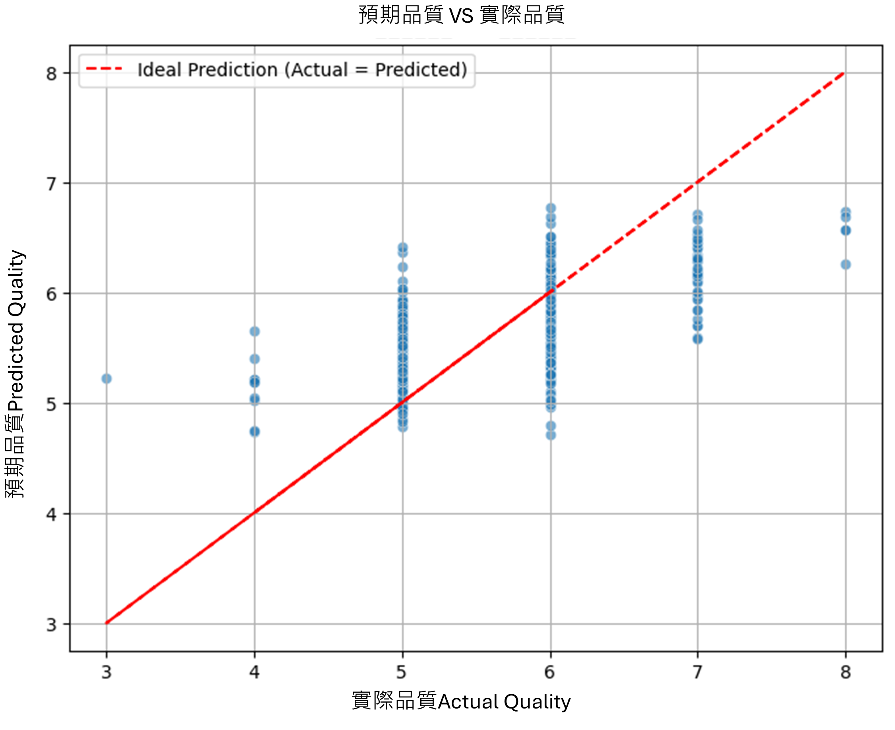

# HW_2
# 🍷 5114056042_hw2 - 紅酒品質預測分析：基於線性迴歸與 Lasso 特徵選擇

## 專案概述 (Project Overview)

本專案採用 **CRISP-DM 流程**，旨在利用紅酒的 11 種理化性質（如酒精、酸度）數據，建立一個**高可解釋性**的多元線性迴歸模型，用以預測紅酒的品質分數 (`quality`)。

### 核心目標

* **模型類型：** 多元線性迴歸 (Multiple Linear Regression)
* **數據集：** Wine Quality - Red (1599 筆樣本)
* **特徵選擇方法：** Lasso 迴歸 (L1 正則化)

### 程式碼連結

* **Google Colab Notebook (主程式碼):** (https://colab.research.google.com/drive/1rm4wbxlu2yopSY1-R1w3xSe6SZYscUvJ?usp=sharing)

---

## 🎯 CRISP-DM 關鍵執行成果 (Key Results)

### 1. 資料準備與特徵選擇 (Data Preparation & Feature Selection)

* **數據處理：** 數據集無缺失值，所有特徵均通過 `StandardScaler` 進行標準化。
* **Lasso 選擇結果：** 原始 11 個特徵中，最終選定了 **8** 個與品質高度相關的特徵子集，排除了貢獻度極低的特徵，優化了模型結構。
* **關鍵選定特徵：** `fixed acidity`, `volatile acidity`, `chlorides`, `free sulfur dioxide`, `total sulfur dioxide`, `pH`, `sulphates`, `alcohol`

### 2. 模型性能與結果 (Modeling & Evaluation)

本專案使用選定特徵訓練普通線性迴歸模型，在測試集上的性能表現如下：

| 指標 (Metric) | 數值 (Value) | 備註 (Interpretation) |
| :--- | :--- | :--- |
| **R-squared ($R^2$)** | **0.4006** | 模型可解釋品質變異的比例。 |
| **RMSE** | **0.6259** | 平均預測誤差僅為 **0.63** 分，證明模型穩健。 |

#### **核心模型係數（已標準化）**

| 特徵 | 係數 (Coefficient) | 影響方向 |
| :--- | :--- | :--- |
| `fixed acidity` | **0.302880** | **最強正向影響** |
| `alcoho` | **-0.169335** | **最強負向影響** |

### 3. 視覺化證明 (Visual Evidence)

**圖表說明：** 散點圖顯示數據點集中在理想預測線 ($y=x$) 周圍，**垂直離散度低**，證明 $\text{RMSE}=0.6259$ 的結果是視覺上可驗證的。

---

## 💡 AI 輔助與未來展望

* **AI 輔助內容：** 報告中包含與 GPT 的對話紀錄 (PDF) 及 NotebookLM 對主流解法 (如 Random Forest/GBM) 的研究摘要。
* **模型比較：** 雖然本專案的線性模型具備最高的**可解釋性**，但未來可考慮轉為**分類任務**，並使用 GBM 等非線性模型來追求更高的預測**準確度**（犧牲可解釋性）。
